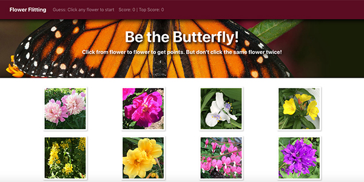

# Flower Flitting
Be the butterfly! This memory-type click game gives players 1 point for each flower they click. With each click the images reshuffle. If the player clicks the same image again they lose all points and the game restarts. 

**Play the game:** https://bourneid7.github.io/react-click-game 

## Getting started
To start this React app on a development server, clone the repo and the run npm install. Then run npm start.

## Technologies used

* React/React-DOM
* JSX
* Bootstrap

## How it works

* Images are pulled randomly from a JSON file. All flower images are my own photography.
* A map function creates the grid of images.
* React state is used to manage player score, top score, and guess message.
* Each time an image is clicked the ID is passed to an array of already guessed images. An if/else statement and indexOf this array is used to determine if the guess is good or bad and run the corresponding function.

## Deployment
* Run npm run build

